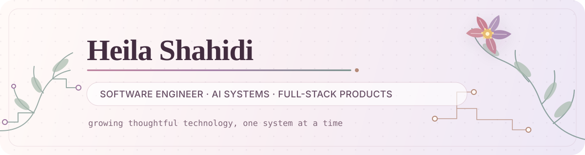

  

   

  
  

## Hello

I'm a software engineer at **HouseAccount**, based in Austin, building AI agents, real-time systems, and full-stack products. I enjoy turning ambitious ideas into dependable software—from adversarial AI evaluation to distributed communication platforms and on-chain markets.

- Building at the intersection of **applied AI and product engineering**
- Interested in **agent reliability, distributed systems, and human-centered tools**
- Focused on systems that are useful beyond the demo

## Featured projects

<table>
  <tr>
    <td width="50%" valign="top">
      <h3><a href="https://github.com/heilashahidi/adversarial-openemr">Adversarial OpenEMR</a></h3>
      
A multi-agent evaluation platform that continuously red-teams a live clinical co-pilot with seeded attacks, LLM judges, and deterministic regression testing.

      
<code>Python</code> <code>AI Agents</code> <code>Evaluation</code>

    </td>
    <td width="50%" valign="top">
      <h3><a href="https://github.com/heilashahidi/bilingual-whatsapp-platform">Bilingual WhatsApp Platform</a></h3>
      
A real-time WhatsApp-to-web bridge serving 1,000+ field agents across three countries, with AI-powered translation, classification, and incident clustering.

      
<code>TypeScript</code> <code>React</code> <code>Real-time</code>

    </td>
  </tr>
  <tr>
    <td width="50%" valign="top">
      <h3><a href="https://github.com/heilashahidi/meridian-blockchain">Meridian</a></h3>
      
A non-custodial options dApp on Solana with an on-chain order book, oracle-based settlement, and a polished Next.js trading experience.

      
<code>Solana</code> <code>Rust</code> <code>Next.js</code>

    </td>
    <td width="50%" valign="top">
      <h3><a href="https://github.com/heilashahidi/autonomous-sales-agent">Autonomous Sales Agent</a></h3>
      
A real-time voice AI system with interruption handling, cross-call memory, grounded answers, synthetic prospect testing, and KPI tracking.

      
<code>Python</code> <code>FastAPI</code> <code>React</code>

    </td>
  </tr>
</table>

## Toolkit

  
  
  
  
  
  
  
  

---

  Have an interesting problem to solve? <a href="https://www.linkedin.com/in/heilashahidi/">Let's connect.</a>

